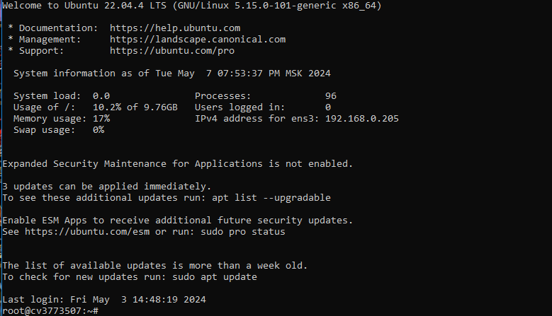

## Подключиться к серверу на reg.ru с помощью ssh

По шагам:

Получить доступ к учетной записи на reg.ru. Для этого необходимо перейти по ссылке в личном кабинете Нетологии в раздел занятий «Доступ к VPS от Reg.ru» и зарегистрироваться на сайте.

Установите терминал с ssh-клиентом:

* для Ubuntu/Fedora/Centos/и т.д. - ssh-клиент уже установлен, ничего делать не надо
для macOS — ssh-клиент уже установлен, ничего делать не надо
для Windows – рекомендуется установить wsl 2
Создать сервер в личном кабинете на reg.ru (подробности в создании сервера на reg.ru )

* Узнайте IP созданного сервера, логин и пароль пользователя на сервере (в личном кабинете).

* Начать управление сервером с помощью ssh (ввести команду в свой терминал):

* ssh имя_пользователя@ip_сервера
После этого введите пароль пользователя (при вводе пароля не будет - это сделано специально в целях безопасности).

В качестве результата прикрепите скриншот терминала, когда вы подключались к серверу.

#
